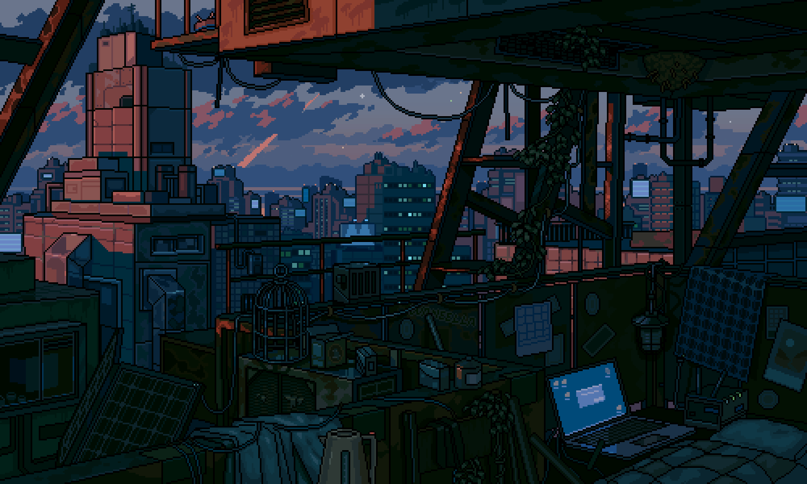
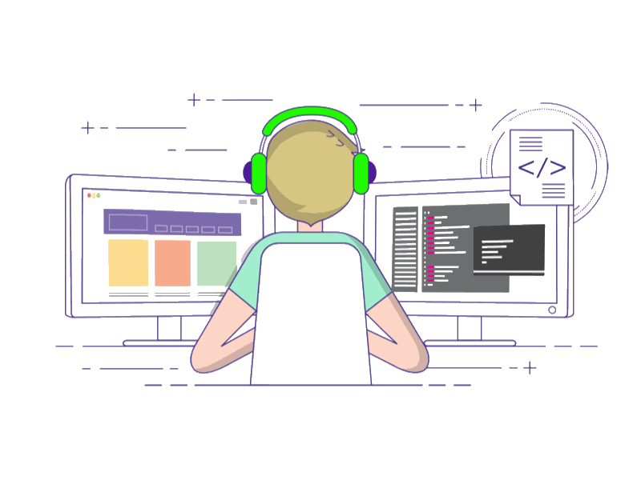

  
   

<!-- 

  

 -->

<!-- MasterHead -->

<!-- <h1 align="left">

Greeting
</h1> -->
 
<h1 align="center">Hi 👋 I'm Abdulrahman</h1>

<h4 align="left">🌟 I'm currently pursuing a Bachelor's degree in Computer Engineering, with a strong focus on building my programming skills through real-world projects. After learning React.js, I’ve started working with Next.js to deepen my understanding of modern web development. While I’m currently focused on mastering frontend and full-stack concepts using Next.js, I plan to explore backend development more deeply in the future. My journey is driven by a passion for learning and creating scalable, efficient software solutions.</h4>

 

<!-- Profile Views -->

<!-- Total Stars with GitHub Logo -->

<!-- Followers with GitHub Logo -->

<!--👀VIEWS / 🌐WEBSITE: https://github.com/antonkomarev/github-profile-views-counter -->

<!-- about me -->
 <h3 align="left">💫 About Me</h3>

<!-- 

   
   
 -->

<h4> 
  🌱 I am currently developing my skills in frontend and full-stack web development.
🔭 I have experience with React.js and I’m currently learning Next.js to build modern, scalable web applications.
💬 I’ve worked with several popular React libraries and tools that enhance state management, form handling, routing, and styling.
⚡ I’m planning to explore backend development soon, along with topics like system architecture, APIs, and databases.
✨ I’m driven by a passion for clean code, performance, and continuous learning.</h4>
<h3>🧲 Connect me :</h3>

<!-- 

  

  

  

</h4>

 
-->
<!-- Experence and experencing
<h3 align="center">🔆 Work'ed and Wor'king</h3>

    
    

 -->

<!-- git stat-->
<h3 align="center">🌱 Github Status</h3>
 

  
  
  
<!-- Proudly created with GPRM ( https://gprm.itsvg.in ) -->
  

  

<!-- lang-->
<h3 align="center">📚 Languages & tools I Have placed My Hands On </h3>

 

   
  

      
      
      
      
      
      
    
  

     
    
    <!-- comming Soon ....
      -->

 

<!-- top repo and teck stack

  <h3>⭐️ Best Repositories</h3>
  

    
    

 -->

  <!-- <h3>💻 Tech Stack:</h3>
      
  

  
  
  
  
  
  
  
  

  
 
  
 -->

<!--<h3>⭐ Top Contributed Repo!</h3>
        
      
       -->

<!-- support -->
<!-- <h3 align="center">Support Me 💰 </h3>

  
 

 -->

<!--<h1 align="center">
    
</h1>-->

<!-- ending-->

⚠️ This README is designed by <strong>ENG-BXI</strong>.
